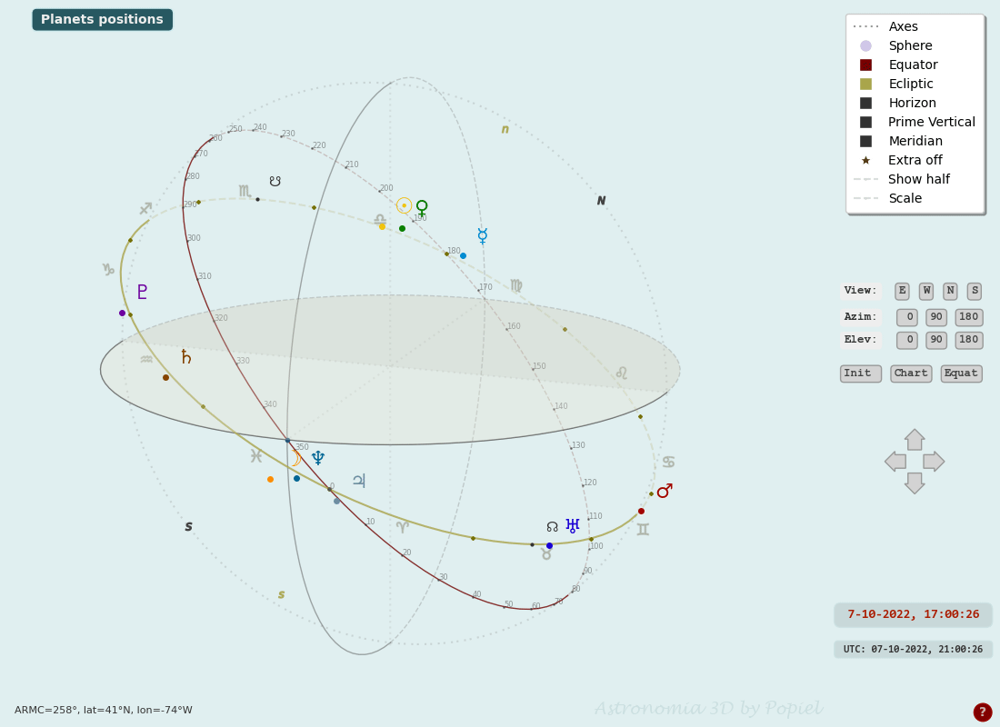

# Astronomia3D
Astronomy. Planets' positions animation.

This program uses Swiss Ephemeris (authors: Dieter Koch and Alois Treindl) and Python extension to the Swiss Ephemeris, Pyswisseph (author: Stanislas Marquis).
    
    [astro.com/swisseph](https://www.astro.com/swisseph/)
    
    [astro.com/swisseph](https://astrorigin.com/pyswisseph/)
    
    [github.com/astrorigin/pyswisseph](https://github.com/astrorigin/pyswisseph)  
    
